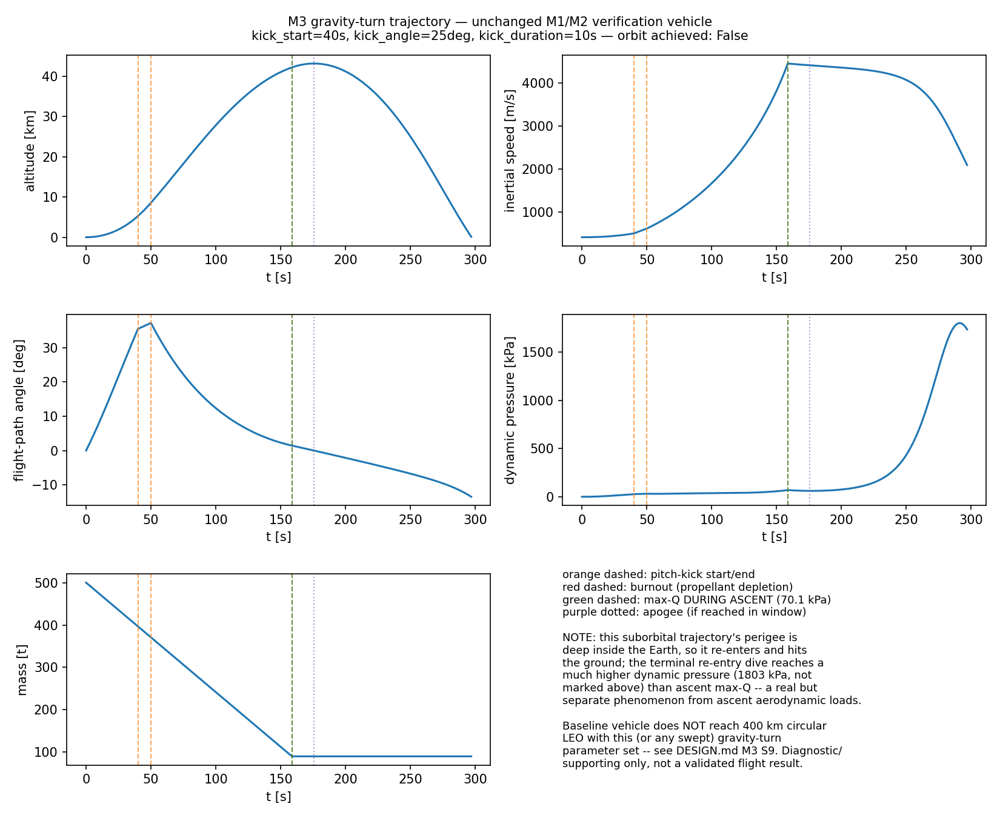
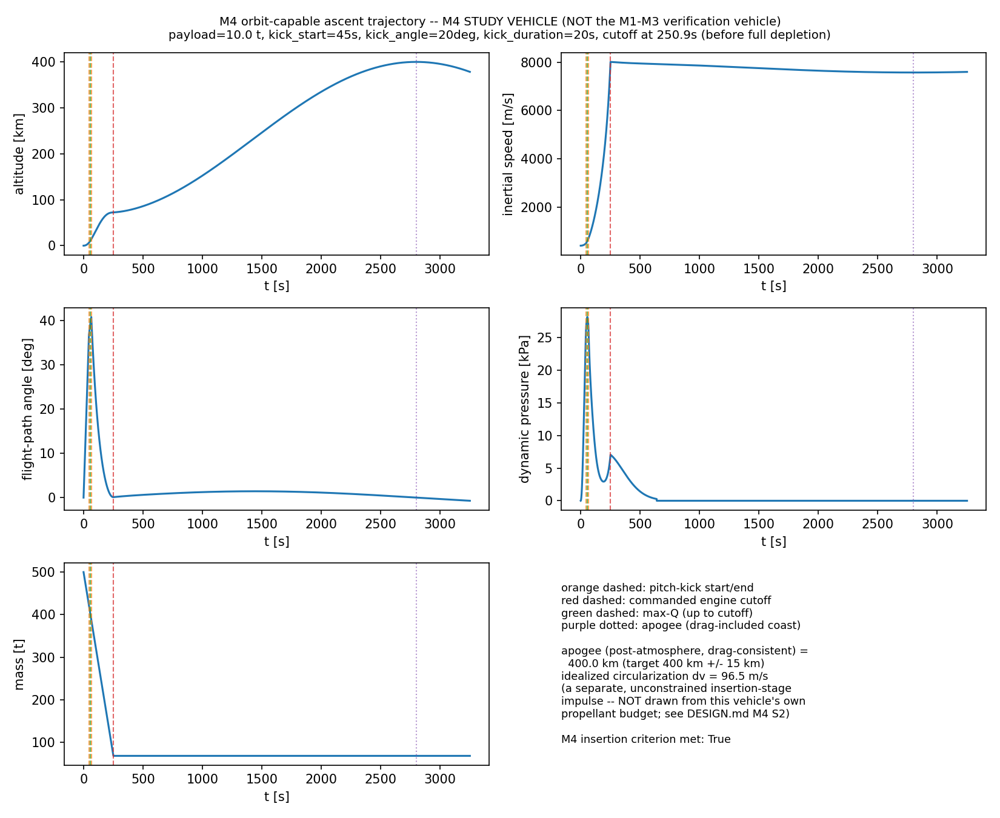
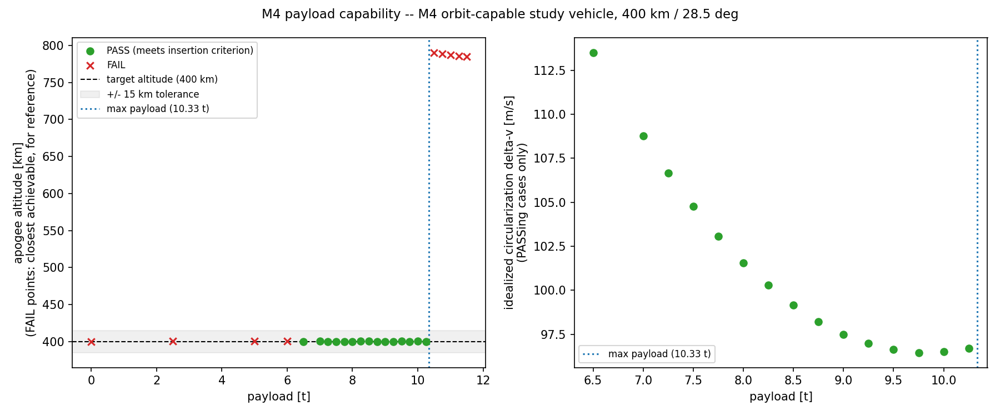
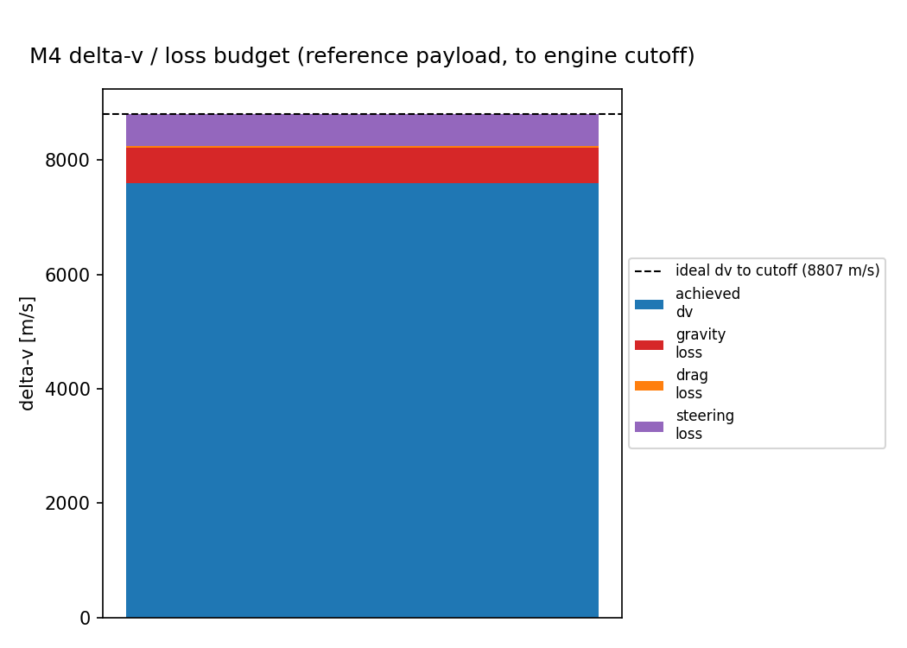
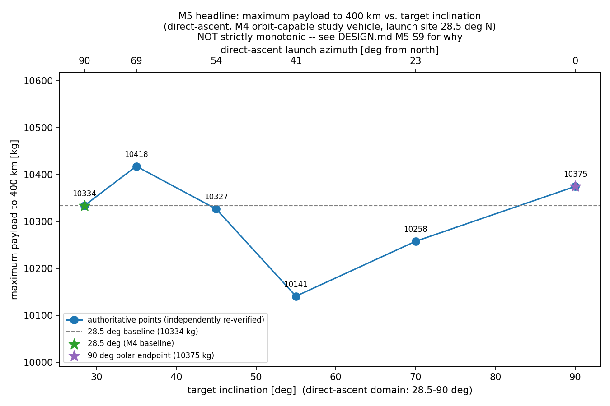
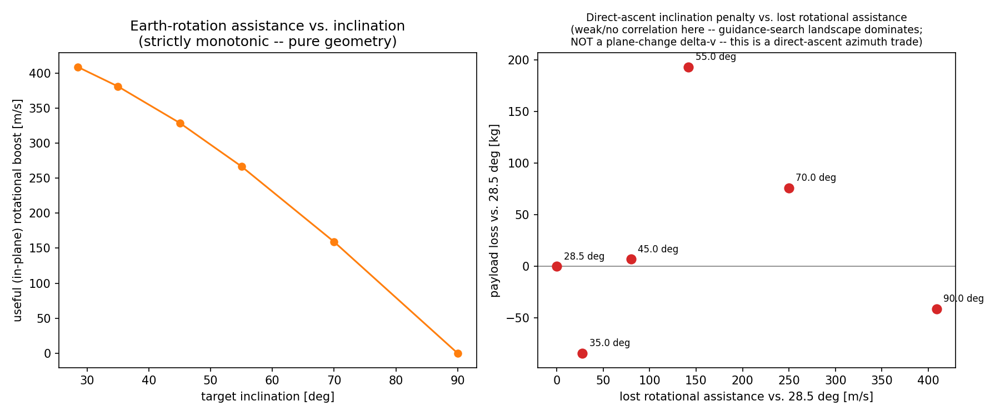

# Ascent Trajectory / Gravity Turn

A launch-vehicle ascent-trajectory engineering study: point-mass gravity-turn ascent
dynamics, a verified orbit-capable study vehicle, its payload-to-orbit capability, and
how that capability changes with target orbital inclination via direct ascent.

Built milestone-by-milestone (M1–M6), each one independently verified and committed.
Full derivations, conventions, and per-milestone verification detail live in
[`DESIGN.md`](DESIGN.md); this page is the consolidated summary.

## 1. Project objective

1. Implement and verify a planar point-mass gravity-turn ascent simulation.
2. Determine whether a single-stage baseline vehicle, sized purely for physics
   verification, reaches a 400 km circular LEO — and if not, why.
3. Define a separate, explicitly labeled orbit-capable study vehicle and solve for its
   maximum payload to 400 km / 28.5°.
4. Quantify how that payload changes as the target inclination is swept from the
   launch site's minimum (28.5°) up to polar (90°) via direct ascent.

## 2. Key results

| Result | Value |
|---|---|
| M1–M3 verification vehicle reaches 400 km circular orbit? | **No** — 0/25 guidance cases (expected; Δv-deficient by design, see [`DESIGN.md` §7.4](DESIGN.md#74-does-this-vehicle-reach-orbit-a-first-order-check)) |
| M4 orbit-capable study vehicle, max payload @ 400 km / 28.5° | **≈ 10.33 t** (10,333 kg PASS / 10,334 kg FAIL boundary) |
| M5 payload @ 28.5° (baseline) | 10,334 kg |
| M5 payload @ 90° (polar) | 10,375 kg (**+0.40%**, not a penalty) |
| M5 payload range across 28.5°–90° | 10,141–10,418 kg |
| Useful Earth-rotation assistance, 28.5° → 90° | 408.7 m/s → ~0 m/s (strictly monotonic) |
| Payload vs. inclination monotonic? | **No** — and M6 sensitivity testing shows this is largely a guidance-search-resolution effect, not a validated physical trend (§9) |
| Tests passing | 119/119 (`pytest -W error`) |

## 3. Model architecture

```
src/ascent/
    constants.py        Earth constants, M1-M3 baseline vehicle, M4 study vehicle
    atmosphere.py        exponential density model
    propulsion.py        mass-flow / thrust / Tsiolkovsky helpers
    dynamics.py           planar point-mass ascent ODE + Earth-rotation/relative-wind handling
    controls.py            gravity-turn guidance law + prescribed thrust-direction profiles
    simulation.py         solve_ivp wrapper + event handling
    orbital.py             orbital-element diagnostics + orbit-insertion criteria
    insertion_search.py    drag-consistent engine-cutoff search
    loss_budget.py           delta-v / loss accounting
    inclination.py           direct-ascent launch-azimuth/inclination geometry
```

## 4. Dynamics and reference frames

- **Planar, point-mass**, Earth-Centered Inertial polar-coordinate state
  `y = [r, θ, v, γ, m]` — no 6-DOF, no out-of-plane vehicle motion.
- **Spherical Earth**, exponential atmosphere (ρ₀ = 1.225 kg/m³, scale height 8500 m,
  vacuum above 100 km).
- **Launch azimuth** `Az`, clockwise from true north; direct-ascent inclination
  `cos(i) = cos(lat) · sin(Az)`; useful in-plane rotational boost
  `v_rot,useful = ω_E · R_E · cos(lat) · sin(Az)`; out-of-plane atmospheric component
  `v_rot,cross = ω_E · R_E · cos(lat) · cos(Az)`.
- **Atmosphere-relative wind**: a documented hybrid — the vehicle's own dynamics stay
  planar (no cross-track velocity state), but drag's relative-wind speed includes the
  atmosphere's real out-of-plane rotational component for non-due-east azimuths, so drag
  is not silently understated at high inclination. Exact regression to the M1–M4 formula
  at due-east (`Az = 90°`) — see [`DESIGN.md` §15.3](DESIGN.md#153-atmosphere-relative-wind-treatment-important-audit-point).

Full equations, sign conventions, and hand calculations: [`DESIGN.md` §1–§9](DESIGN.md).

## 5. Verification vehicle (M1–M3)

The original "Ascent-1" vehicle (Isp = 300 s) exists **only to verify the dynamics,
guidance law, and integration** — vertical rise → pitch-kick → zero-AoA gravity turn,
25-case guidance sweep, full event handling and convergence checks. **It does not reach
400 km circular orbit under any tested guidance** — a known, expected Δv deficit, not a
bug. It must never be read as an orbit-capable launch vehicle.



## 6. Orbit-capable M4 study vehicle

A **separate, explicitly distinct vehicle** (higher Isp = 450 s, higher propellant
fraction) introduced specifically for the payload/insertion study — never a retune of
the M1–M3 vehicle. Insertion criterion: bound, non-Earth-intersecting orbit with apogee
within 15 km of the 400 km target and an idealized (unconstrained, not deducted from
vehicle propellant) circularization Δv ≤ 1500 m/s.



## 7. Payload capability

Maximum payload to 400 km / 28.5° at the fixed guidance (kick_start=45 s,
kick_angle=20°, kick_duration=20 s): **10,333 kg PASS / 10,334 kg FAIL** (1 kg
bisection tolerance). Reported as **≈10.33 t** — see [`DESIGN.md` §16.6](DESIGN.md#166-m4-reference-payload--recomputation-and-resolution-statement)
for why more digits than that are not physically meaningful here.



## 8. Delta-v / loss budget

`achieved_dv = ideal_dv_to_cutoff − steering_loss − drag_loss − gravity_loss`, an exact
algebraic decomposition over the powered-flight interval for this vehicle/guidance/model
— **not** a universal launch-vehicle Δv budget.



## 9. Direct-ascent inclination study

Guidance is **independently re-optimized per inclination** (not frozen), using the same
unchanged M4 insertion criterion. Six authoritative inclinations were computed
(28.5°/35°/45°/55°/70°/90°); connecting lines in the figure are a **visual aid only**,
not a validated continuous curve — only these six points were actually solved.




**Two different curves, two different natures**:
- **Useful Earth-rotation assistance** (right-hand figure) is pure geometry and is
  **strictly monotonically decreasing** with inclination — 408.7 → 0 m/s.
- **Maximum payload** (left-hand figure) is the output of a bounded local
  guidance-parameter search and is **not monotonic** — 10,141–10,418 kg across the swept
  range, with 90° (10,375 kg) actually 0.40% *above* the 28.5° baseline (10,334 kg).

A dedicated M6 sensitivity check (widening the local search from a perturbed seed) found
an *alternate* local optimum at 35° worth **10,680 kg — 2.5% higher** than the value in
the authoritative table, which by itself exceeds the entire inter-inclination spread.
**Conclusion: the payload non-monotonicity is not demonstrated to be a robust orbital-
mechanics effect — it is, at least in part, a guidance-search-resolution artifact.** The
28.5°/90° endpoint comparison is trusted; the interior ordering (35°/45°/55°/70°) should
be read as illustrative of search sensitivity, not as a validated ranking. Full evidence:
[`DESIGN.md` §16.9](DESIGN.md#169-non-monotonicity--one-focused-sensitivity-check-this-milestone).

This is a **direct-ascent** trade under a simplified model: no dogleg, no on-orbit plane
change, no retrograde launch. The 90° result is **not** a "plane-change penalty" — no
plane change is modeled anywhere in this project; it is the direct-ascent consequence of
reduced launch-site rotational assistance.

## 10. Verification and convergence

- Analytical/unit checks (M1): sign conventions, hand-calculation cross-checks.
- Trajectory/integration checks (M2–M3): zero-drag limit, ballistic limit, mass-flow
  consistency, Tsiolkovsky consistency, Earth-rotation check, dimensional/sign checks.
- Mass-bookkeeping and payload-boundary tests (M4–M5).
- Inclination-geometry and atmosphere-relative-wind regression tests (M5).
- Integrator convergence at 28.5°/55°/90° across 3 solver tolerance tiers (M5, reread
  not rerun in M6 — see [`DESIGN.md` §16.11](DESIGN.md#1611-convergence--final-statement)).
- CSV reproducibility: independently re-run and diffed in M6 —
  [`DESIGN.md` §16.2](DESIGN.md#162-independent-csv-reproduction).

**119/119 tests passing** under `pytest -W error`.

## 11. Engineering interpretation

- The early vehicle/model is useful for physics verification but is **not orbit-capable**
  under the tested control strategy.
- The separate M4 study vehicle demonstrates **≈10.33 t payload capability** to 400 km /
  28.5°.
- Direct-ascent useful Earth-rotation assistance **decreases monotonically** with
  increasing target inclination — this is deterministic geometry.
- Maximum payload **does not** decrease monotonically in the computed M5 search.
- For this model, the payload differences across inclination are small enough (order
  1–3%) that guidance-search sensitivity (also order 1–2.5%, §9) is comparable to, and
  in at least one case exceeds, the pure rotational-assistance effect.
- The 90° direct-ascent case does **not** incur a "plane-change penalty" — the vehicle
  launches directly into the target plane; no plane change is modeled.

## 12. Limitations

- Planar ascent dynamics — no 6-DOF, no true 3-D launch-site geometry propagation.
- Hybrid (not fully 3-D) treatment of out-of-plane atmospheric rotation — see §4.
- Simplified exponential atmosphere, constant drag coefficient.
- Simplified single-stage propulsion model, no throttling, no staging.
- Guidance is a bounded local parameter search, not global optimal control — the true
  optimum at any given inclination is not known, only a lower bound (§9).
- No winds, no launch corridor / range-safety constraints, no structural/load model
  beyond the quantities already computed, no dispersions / Monte Carlo.
- Circularization is an idealized impulsive Δv, not a modeled finite-burn insertion
  stage, and is not deducted from vehicle propellant.
- Sparse M5 inclination sampling (6 points); severe computational stiffness was found
  and fixed near the polar case (§[`DESIGN.md` §15.7](DESIGN.md#157-genuine-bugs-found-and-fixed-near-polar-regime)).
- Payload results depend on guidance-search quality, quantified but not eliminated in M6
  (§9).

This is an **engineering portfolio study**, not a flight-performance certification.

## 13. Repository structure

```
DESIGN.md       mission definition, equations, conventions, hand calcs, verification
                plan, limitations, full per-milestone implementation notes (M1-M6)
LICENSE          MIT
src/ascent/     simulation package (see §3)
tests/          pytest test suite (119 tests)
scripts/        m2_diagnostic_trajectory.py, m3_gravity_turn_sweep.py, m3_trajectory.py,
                m4_guidance_search.py, m4_payload_sweep.py, m4_trajectory.py,
                m4_payload_figure.py, m5_inclination_sweep.py, m5_finalize_results.py,
                m5_figures.py, final_portfolio_summary.py
figures/        generated figures (6 embedded above; 2 additional diagnostics kept for
                reference — m2_diagnostic_trajectory.png, m3_velocity_components.png)
```

## 14. Reproduction

```bash
python3 -m venv .venv && source .venv/bin/activate
pip install -e ".[dev]"
pytest -W error
```

**Fast verification path** (~1 minute; recommended for routine reproduction):

```bash
python scripts/m5_finalize_results.py       # re-verifies all 6 M5 rows independently
python scripts/final_portfolio_summary.py   # prints the consolidated headline report
```

**Full regeneration path** (documented, not a quick-start — the M5 sweep in particular
is computationally expensive near the polar case, see [`DESIGN.md` §16.13](DESIGN.md#1613-reproducibility-path)):

```bash
python scripts/m3_gravity_turn_sweep.py
python scripts/m4_payload_sweep.py
python scripts/m5_inclination_sweep.py
```

## License

[MIT](LICENSE).
