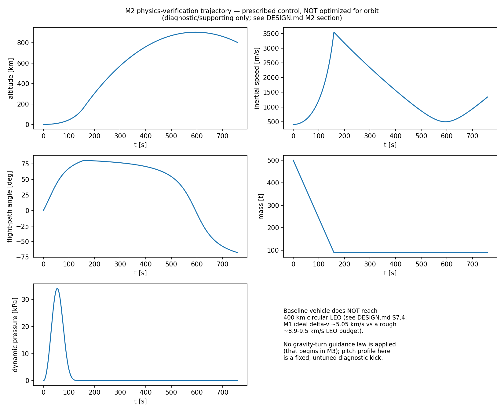

# Ascent Trajectory / Gravity Turn

Launch-vehicle ascent simulation portfolio project. Goal: produce (1) an ascent
trajectory profile for a single-stage-baseline launch vehicle flying a gravity-turn
ascent to a target circular LEO, and (2) a payload-to-orbit trade curve versus target
orbital inclination.

This project is built **milestone-by-milestone**. Each milestone is committed and pushed
individually; no milestone is started before the previous one is checkpointed and
approved.

## Status

- [x] **M1 — Mission definition, equations, conventions, hand calculations, verification
      plan, limitations.** See [`DESIGN.md`](DESIGN.md). No integrator yet.
- [x] **M2 — Atmosphere + propulsion + point-mass ascent ODE + basic trajectory
      verification.** See [`DESIGN.md` §12](DESIGN.md#12-milestone-2--physics-implementation-and-verification).
      Physics verification only, no guidance law; baseline vehicle does **not** reach
      400 km circular LEO with a fixed pitch profile (expected — see §12.9).
- [ ] M3 — Gravity-turn guidance, full trajectory profile, event handling, numerical
      convergence.
- [ ] M4 — Payload-to-orbit solve at the baseline inclination.
- [ ] M5 — Inclination sweep, launch-azimuth/Earth-rotation coupling, payload-vs-
      inclination curve.
- [ ] M6 — Independent validation, sensitivity analysis, figure audit, packaging.

## Important note on figures

Any figure produced before the trajectory model is validated (M3's convergence study and
the M9 checks in `DESIGN.md`) is **diagnostic/supporting only**, not a validated result.
Figures will be explicitly labeled as such until the verification plan in `DESIGN.md`
§9 has been executed.

## Repository layout

```
DESIGN.md       mission definition, governing equations, conventions, hand calcs,
                verification plan, limitations, M2 implementation notes (start here)
src/ascent/     simulation package
    constants.py    Earth constants + M1 baseline vehicle
    atmosphere.py   simplified exponential density model
    propulsion.py   mass-flow / thrust / Tsiolkovsky helpers
    dynamics.py     planar point-mass ascent ODE + Earth-rotation handling
    controls.py     prescribed (non-guided) thrust-direction profiles
    simulation.py   solve_ivp wrapper + event handling
tests/          pytest test suite (atmosphere, propulsion, dynamics, Earth rotation,
                independent verification checks)
scripts/        m2_diagnostic_trajectory.py — diagnostic-only trajectory + figure
figures/        m2_diagnostic_trajectory.png (diagnostic/supporting, not validated)
```

### M2 diagnostic trajectory



Prescribed (non-guided) pitch profile on the unchanged M1 baseline vehicle — see
`DESIGN.md` §12.9. **Diagnostic/supporting only, not a validated result.** The vehicle
does not reach 400 km circular orbit, which is the expected outcome given the Δv
deficit already documented in `DESIGN.md` §7.4.

## Development

```bash
python3 -m venv .venv && source .venv/bin/activate
pip install -e ".[dev]"
pytest -W error
```

## Scope and limitations

See `DESIGN.md` §10 for the full, explicit list of modeling limitations (point-mass only,
no 6-DOF, no winds, simplified atmosphere, constant Cd, no structural/load model, no
throttling, no staging unless later added, no range constraints, no operational
flight-safety claim).
